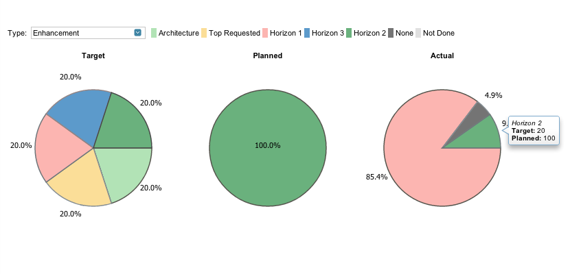

Portfolio Alignment
==========================

##Overview

This is a Rally SDK app that shows pie charts for Target, Planned, and Actual for a particular type (think Strategy, Theme, Initiative, Enhancement, etc). You can hover over to see more information about each pie slice such as the name, target goal, and amount planned. There is also a handy color-coded guide on the top that gives a key to all of the pie slices.

##How to Use

If you want to start using the app immediately, create an Custom HTML app on your Rally dashboard. Then copy PortfolioAlignmentsApp.html from the deploy folder into the HTML text area. That's it, it should be ready to use.

Or you can just click [here](https://raw.github.com/osulehria/rally-portfolio-alignments/master/deploy/PortfolioAlignmentsApp.html) to find the file and copy it into the custom HTML app.

##Customize this App

This app includes a Rakefile with these tasks that will help you deploy the app in such a way that Rally will recognize your code:

Available tasks are:

    rake combine       # Parses mashup HTML and replaces stylesheet includes with the referenced CSS content and JS includes with the JS itself to create Rally-ready HTML
    rake default       # Default task
    rake deploy        # Combine and run jslint
    rake deployall     # Build all apps and copy the built output to lam
    rake jslint        # Runs JSLint on all component JavaScript files
    rake new[appName]  # Create a new app

If you want to include more Javascript files, simply add them to the PortfolioAlignments.template.html within the header. It's the same with CSS files, just add the stylesheet name to the header in the HTML template file.

##License

Portfolio Alignment is released under the MIT license. See the file [LICENSE](https://raw.github.com/osulehria/rally-portfolio-alignments/master/LICENSE) for the full text.